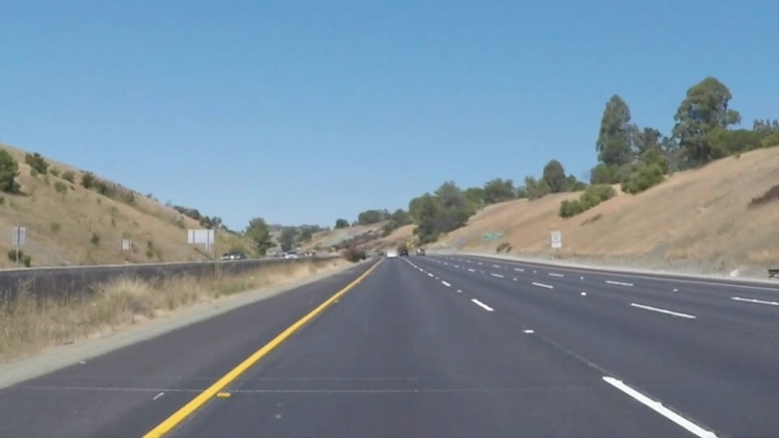
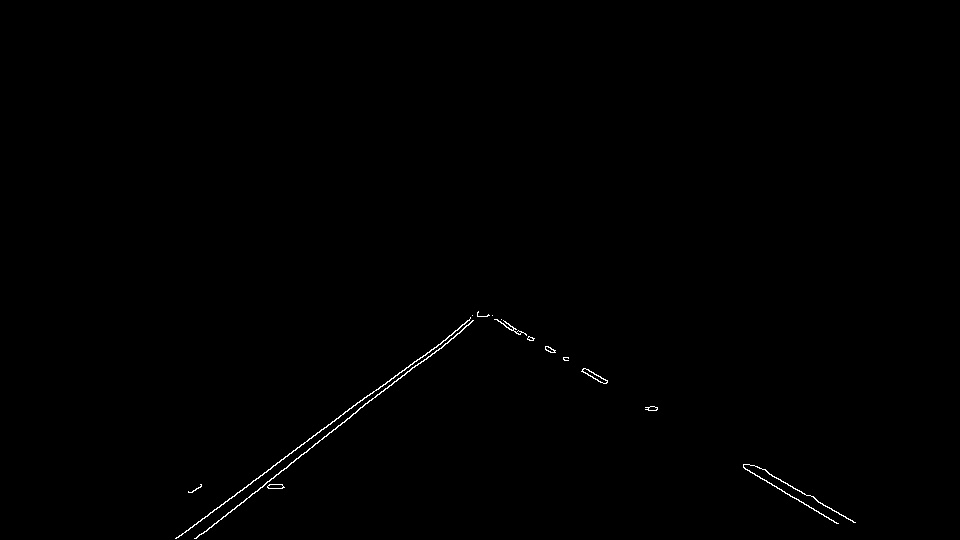

# Finding Lane Lines on the Road

For most driver, it never came to their mind that an algorithm could overtake their constant adjusting of trackholding.

With this project, an algorithm is implemented that can overtake this task.
First, the pipeline for the algorithm implementation is presented. 
The results can be found in the results folder resp. in the LaneDetection.ipynb.

# The Pipeline
## Overview
Here are the steps of the pipeline listed:
* Grayscale conversion
* Gaussian Blurring
* Canny Filtering
* Region of interest
* Hough Line detection
* Drawing lines

We can see here the provided input image. The task is to detect the two lanes.

## Grayscale
This one is easy, just grayscale conversion of the input image:

## Gaussian Blurring
Onto the gray image, a gaussian filter is applied in order to improve the following canny detection algorithm:

## Canny Filtering
Now, based on the blurred image, a canny algorithm is used to detect the locations with a gradient in color change.
These are likely the places of the lanes.

## Region of interest
For this purpose, a triangle is selected in which the lanes are very likely. With this triangle only a selection of lines is used for further processing.
The following is the result:

## Hough lines
In order to find the lane, a hough transformation is used to detect the real lanes.

## Separating lines
Fine. But now we need to separate the lines into right and left lanes.
This is done through comparison if the line is closer to the right or left edge.

## Main lanes
After all, the two main lanes are calculated through sorting the given lines and getting the average x/y-point of the top 20% and lowest 20%.
With this calculation the length can also be determined. 

This result shows also a shortcoming because it is dependent on the distribution of the detected lines.

## Final result
Together with the original image, it looks like that:

# Setup
In order to test the code, just call:
jupyter notebook

The rest is explained right there.

---

### Reflection

### 1. Describe your pipeline. As part of the description, explain how you modified the draw_lines() function.

My pipeline consisted of 5 steps. First, I converted the images to grayscale, then I .... 

In order to draw a single line on the left and right lanes, I modified the draw_lines() function by ...

### 2. Identify potential shortcomings with your current pipeline

The obvious problem is that the calculated lanes are wiggling very much in the video.

Another shortcoming is that the algorithm relies on the position of the camera. If it is moved, the whole lane detection won't work (see challenge.mp4).

Moreover, a curve is not recognized as straight line rather than a part of a ellipse. This could lead to wrong assumptions and be dangerous for self-driving cars.  

### 3. Suggest possible improvements to your pipeline

To solve the wiggling issue, a filter could be applied over all the images. For example a moving average with a low N.

To get rid of the fixed position problem, 

A possible improvement to recognize a curve would be using a approximate a part of a ellipse instead of line. 
